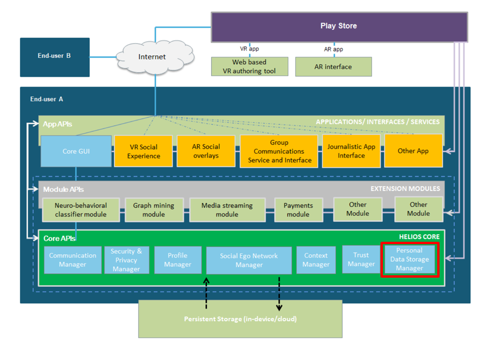

# HELIOS Personal Data Storage API #

## Introduction ##

Personal Data Storage API is used to provide certain unified file storage
abstraction for HELIOS applications without binding these APIs to specific
storage location. Experiment using HTTP and File based transports. Unfied
API interface should be defined that will utilize underlying access APIs.
Because we are expected to also have remote storage the whole API should
be asynchronous.

HELIOS Personal Data Storage API is one of the HELIOS Core APIs as
highlighted in the picture below:

Personal Data Storage API is implemented in HELIOS Core component that
is called Personal Data Storage Manager.

## API usage ##

See javadocs in [javadocs.zip](doc/javadocs.zip).

### Introduction ###

Personal Data Storage API is used to store and load data objects using
HELIOS persistent personal data store. HELIOS personal data store is a
location agnostic storage concept. The storage can be either local or
remote storage. Applications are expected to use asynchronous access
functions also for local storage in order to provide the same API both
for local and remote storage. However, at the moment there is only
implementation for local storage.

### HeliosStorageManager ###

Applications are expected to use `HeliosStorageManager` singleton
class to access HELIOS Personal Data Storage. Applications should call
`getInstance()` method in order to get a singleton instance:

`HeliosStorageManager storage = HeliosStorageManager.getInstance();`

HeliosStorageManager can then be used to access HELIOS Personal Data
Storage.  It is also possible to include a listener class as a
parameter to these methods. The listener class member function
implementing the required interface can be called when the operation
is completed. The listener parameter can also be null, which means
that there is no callback function and operation completion is not
notified.

An object can be requested from the HELIOS Personal Data Storage using
a download method:

`storage.download("object_name", listener);`

An object can be uploaded to the HELIOS Personal Data Storage using an
upload method:

`storage.upload("object_name", data, listener);`

An object can be removed from the HELIOS Personal Data Storage using a
delete method:

`storage.delete("object_name", listener);`

HELIOS Personal Data Storage objects can be listed using a list
command:

`storage.delete("object_name", listener);`

### HeliosStorageUtils ###

There is also HeliosStorageUtils utility class that is used in HELIOS
test client to access local filesystem based HELIOS Personal Data
Storage. These functions are used in order to provide a layer that
can be ported to support also other Personal Data Storage implementations
instead of directly binding th eimplementation to Android File operations.

### Future work ###

The current implementation is using hardcoded local filesystem based
implementation. HELIOS Profile Manager could be used to query user's
settings that can be used to specify location of the personal
storage. Extension modules can be used to provide alternative storage
implementations. Some kind of registering mechanism is then needed.

## Android Studio project structure ##

This Android Studio 3.5 project contains the following components:

* app - Personal Data Storage API test application

* doc - Additional documentation files

* lib - Personal Data Storage API implementation
